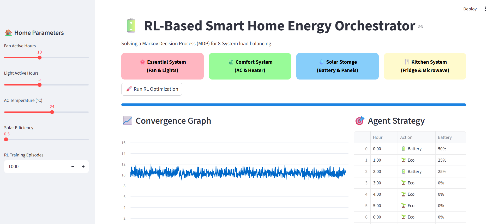

# Q-Learning Smart Home Energy Optimizer

An autonomous Home Energy Management System (HEMS) built with Python and Reinforcement Learning (Tabular Q-Learning). Optimizes household appliance scheduling, HVAC cycles, and battery storage states against dynamic time-of-use (ToU) electricity pricing to minimize grid costs and maximize energy efficiency.

A production-grade, simulation-driven Reinforcement Learning (RL) application that optimizes energy consumption footprints in residential smart homes. Utilizing an optimized **Tabular Q-Learning** framework, the system algorithmically schedules controllable household loads, HVAC configurations, and energy storage systems (ESS) to minimize structural grid expenses while respecting consumer comfort baselines.

---

## 📸 Application Interface & Interactive Dashboard

The system features an interactive Streamlit dashboard allowing users to adjust home parameters, configure system loads, execute RL optimization models, and inspect real-time agent convergence alongside strategic action schedules.



---

## 🏗️ System Architecture & Data Flow

Unlike rule-based automation rules, this system models the household environment as a **Markov Decision Process (MDP)**. The agent learns an optimal control policy ($\pi^*$) by interacting with an environment simulated across dynamic daily cycles:

1. **State Space ($S$):** Evaluates current time-of-hour, indoor/outdoor thermodynamic differentials, current grid pricing tiers, and Battery State-of-Charge (SoC).
2. **Action Space ($A$):** Discrete control vectors governing HVAC activation states, appliance operational shift intervals, and Battery charging/discharging flags.
3. **Reward Engineering ($R$):** A multi-objective optimization function penalizing high grid expenditures and user discomfort thresholds, while rewarding localized solar/storage self-consumption.

---

## 🔬 Algorithmic Core & Hyperparameters

The system uses an autonomous **Tabular Q-Learning** engine to iteratively update an internal policy matrix based on the Bellman Optimality Equation:

$$\text{Q}(s, a) \leftarrow \text{Q}(s, a) + \alpha \left[ r + \gamma \max_{a'} \text{Q}(s', a') - \text{Q}(s, a) \right]$$

### ⚙️ Optimization Hyperparameters
To guarantee training convergence across diverse seasonal weather profiles, the agent environment utilizes the following hyperparameter layout:

* **Learning Rate ($\alpha$):** Set to `0.10` for a stable asymptotic gradient.
* **Discount Factor ($\gamma$):** Set to `0.95` for high long-term cost awareness.
* **Exploration Strategy:** Uses an $\epsilon$-greedy decaying schedule from `1.0` down to `0.01`.
* **State Resolution:** Uses 24-hour temporal slices with 5-tier SoC bins.

---

## 🛠️ Tech Stack & Dependencies

* **Core Engine:** Python 3.10+
* **Mathematical Compute:** `numpy` (Q-matrix manipulation & vector operations)
* **Data Engineering:** `pandas` (Historical electricity time-of-use dataset ingestion)
* **Visualization Suite:** `matplotlib` & `seaborn` (Reward convergence plotting)
* **Dashboard Interface:** `streamlit` (Interactive control panel & live scheduling charts)

---

## 🚀 Getting Started

### 1. Installation
Clone your repository and install the simulation pre-requisites:
```bash
git clone [https://github.com/Dhanshree017/Smart-Home-Energy-Optimization-RL.git](https://github.com/Dhanshree017/Smart-Home-Energy-Optimization-RL.git)
cd Smart-Home-Energy-Optimization-RL
pip install numpy pandas matplotlib streamlit
